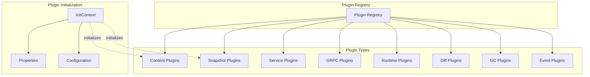
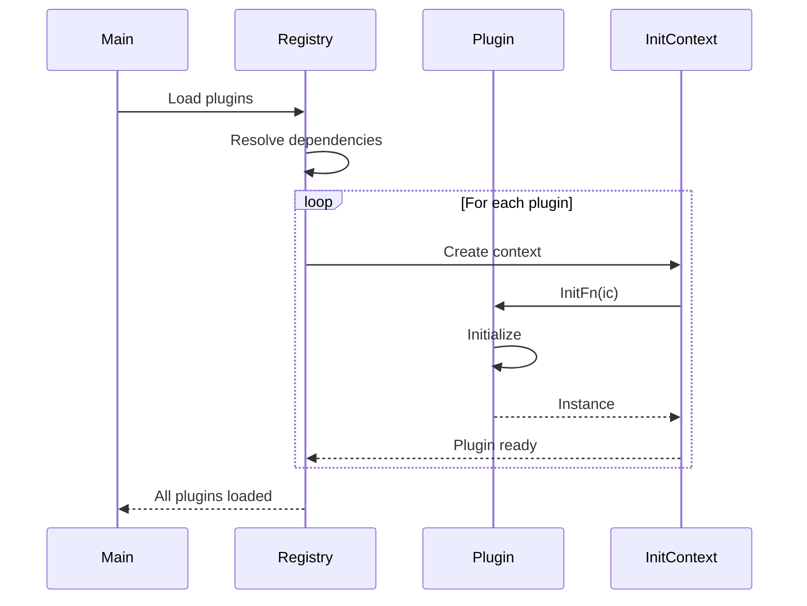
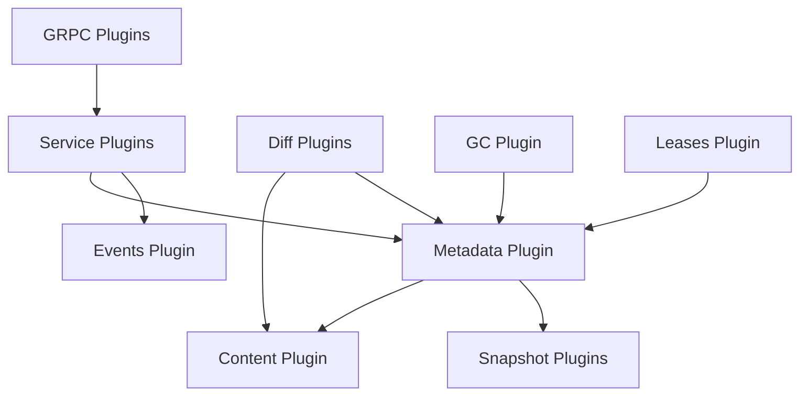
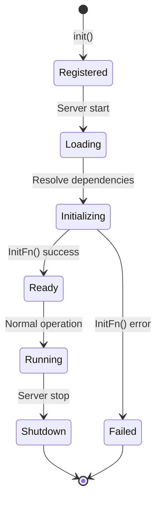

# containerd Plugins Architecture

## Overview

containerd is built around a plugin-based architecture that allows extending functionality without modifying the core daemon. Plugins implement the interfaces defined in the core packages and are loaded dynamically at runtime.

**Location**: `plugins/`

## Plugin System Architecture



## Plugin Types

### Plugin Type Definitions

**File**: `plugins/types.go`

```go
const (
    // InternalPlugin implements an internal plugin to containerd
    InternalPlugin plugin.Type = "io.containerd.internal.v1"
    
    // RuntimePlugin implements a runtime
    RuntimePlugin plugin.Type = "io.containerd.runtime.v1"
    RuntimePluginV2 plugin.Type = "io.containerd.runtime.v2"
    
    // ServicePlugin implements an internal service
    ServicePlugin plugin.Type = "io.containerd.service.v1"
    
    // GRPCPlugin implements a grpc service
    GRPCPlugin plugin.Type = "io.containerd.grpc.v1"
    
    // TTRPCPlugin implements a ttrpc shim service
    TTRPCPlugin plugin.Type = "io.containerd.ttrpc.v1"
    
    // SnapshotPlugin implements a snapshotter
    SnapshotPlugin plugin.Type = "io.containerd.snapshotter.v1"
    
    // TaskMonitorPlugin implements a task monitor
    TaskMonitorPlugin plugin.Type = "io.containerd.monitor.task.v1"
    ContainerMonitorPlugin plugin.Type = "io.containerd.monitor.container.v1"
    
    // DiffPlugin implements a differ
    DiffPlugin plugin.Type = "io.containerd.differ.v1"
    
    // MetadataPlugin implements a metadata store
    MetadataPlugin plugin.Type = "io.containerd.metadata.v1"
    
    // ContentPlugin implements a content store
    ContentPlugin plugin.Type = "io.containerd.content.v1"
    
    // GCPlugin implements garbage collection policy
    GCPlugin plugin.Type = "io.containerd.gc.v1"
    
    // EventPlugin implements event handling
    EventPlugin plugin.Type = "io.containerd.event.v1"
    
    // LeasePlugin implements lease manager
    LeasePlugin plugin.Type = "io.containerd.lease.v1"
    
    // StreamingPlugin implements a stream manager
    StreamingPlugin plugin.Type = "io.containerd.streaming.v1"
    
    // SandboxControllerPlugin implements a sandbox controller
    SandboxControllerPlugin plugin.Type = "io.containerd.sandbox.controller.v1"
    
    // CRIServicePlugin implements a cri service
    CRIServicePlugin plugin.Type = "io.containerd.cri.v1"
)
```

## Plugin Registration

### Registration Pattern

Plugins register themselves using the `init()` function:

```go
package plugin

import (
    "github.com/containerd/plugin"
    "github.com/containerd/plugin/registry"
    "github.com/containerd/containerd/v2/plugins"
)

func init() {
    registry.Register(&plugin.Registration{
        Type: plugins.ContentPlugin,
        ID:   "content",
        InitFn: func(ic *plugin.InitContext) (interface{}, error) {
            // Initialize plugin
            root := ic.Properties[plugins.PropertyRootDir]
            return local.NewStore(root)
        },
    })
}
```

### Plugin Registration Structure

```go
type Registration struct {
    // Type of the plugin
    Type plugin.Type
    
    // ID of the plugin
    ID string
    
    // Requires lists plugin dependencies
    Requires []plugin.Type
    
    // Config for the plugin (TOML-decodable struct)
    Config interface{}
    
    // ConfigMigration function for config upgrades
    ConfigMigration func(context.Context, int, interface{}) error
    
    // InitFn initializes the plugin
    InitFn func(*plugin.InitContext) (interface{}, error)
}
```

### Plugin Initialization Context

```go
type InitContext struct {
    Context    context.Context
    Root       string
    State      string
    Config     interface{}
    Properties map[string]string
    Meta       *Meta
    
    // GetByID gets a plugin by type and ID
    GetByID(t plugin.Type, id string) (interface{}, error)
    
    // GetSingle gets a single plugin by type
    GetSingle(t plugin.Type) (interface{}, error)
    
    // GetByType gets all plugins of a type
    GetByType(t plugin.Type) (map[string]interface{}, error)
}
```

### Plugin Loading Flow



## Core Plugin Implementations

### 1. Content Plugin

**Location**: `plugins/content/local/`  
**Type**: `ContentPlugin`  
**ID**: `content`

Implements local filesystem-based content storage.

#### Registration

```go
func init() {
    registry.Register(&plugin.Registration{
        Type: plugins.ContentPlugin,
        ID:   "content",
        InitFn: func(ic *plugin.InitContext) (interface{}, error) {
            root := ic.Properties[plugins.PropertyRootDir]
            ic.Meta.Exports["root"] = root
            return local.NewStore(root)
        },
    })
}
```

#### Implementation

```go
type store struct {
    root               string
    ls                 LabelStore
    integritySupported bool
    locks              map[string]*lock
}

func NewStore(root string) (content.Store, error) {
    // Create content store directories
    // Initialize lock management
    // Check fsverity support
}
```

#### Storage Layout

```
<root>/
├── blobs/
│   └── sha256/
│       ├── <digest1>
│       └── <digest2>
└── ingest/
    └── <ref>-<random>
```

### 2. Snapshot Plugins

**Location**: `plugins/snapshots/`

Multiple snapshot implementations are available:

#### Overlay Snapshotter

**Type**: `SnapshotPlugin`  
**ID**: `overlayfs`  
**Platform**: Linux

```go
func init() {
    registry.Register(&plugin.Registration{
        Type:   plugins.SnapshotPlugin,
        ID:     "overlayfs",
        Config: &Config{},
        InitFn: func(ic *plugin.InitContext) (interface{}, error) {
            ic.Meta.Platforms = append(ic.Meta.Platforms, platforms.DefaultSpec())
            
            config, ok := ic.Config.(*Config)
            root := ic.Properties[plugins.PropertyRootDir]
            
            var oOpts []overlay.Opt
            if config.UpperdirLabel {
                oOpts = append(oOpts, overlay.WithUpperdirLabel)
            }
            if !config.SyncRemove {
                oOpts = append(oOpts, overlay.AsynchronousRemove)
            }
            
            return overlay.NewSnapshotter(root, oOpts...)
        },
    })
}
```

**Configuration**:

```toml
[plugins."io.containerd.snapshotter.v1.overlayfs"]
  root_path = "/var/lib/containerd/io.containerd.snapshotter.v1.overlayfs"
  upperdir_label = false
  sync_remove = false
  mount_options = []
```

**Features**:
- Uses Linux OverlayFS
- Supports ID-mapped mounts for user namespaces
- Asynchronous removal for performance
- Optional upperdir labeling

#### Btrfs Snapshotter

**Type**: `SnapshotPlugin`  
**ID**: `btrfs`  
**Platform**: Linux

Uses Btrfs subvolumes for snapshots:
- Copy-on-write snapshots
- Native Btrfs features
- Efficient space usage

#### DevMapper Snapshotter

**Type**: `SnapshotPlugin`  
**ID**: `devmapper`  
**Platform**: Linux

Uses device mapper thin provisioning:
- Block-level snapshots
- Thin provisioning
- Direct block device access

#### Native Snapshotter

**Type**: `SnapshotPlugin`  
**ID**: `native`  
**Platform**: Windows

Windows-specific snapshotter:
- Uses Windows filesystem features
- NTFS hard links
- Windows containers support

#### EROFS Snapshotter

**Type**: `SnapshotPlugin`  
**ID**: `erofs`  
**Platform**: Linux

Enhanced Read-Only File System:
- Optimized for read-only layers
- Better compression
- Improved performance

### 3. Diff Plugins

**Location**: `plugins/diff/`

#### Walking Differ

**Type**: `DiffPlugin`  
**ID**: `walking`

```go
func init() {
    registry.Register(&plugin.Registration{
        Type: plugins.DiffPlugin,
        ID:   "walking",
        Requires: []plugin.Type{
            plugins.MetadataPlugin,
        },
        InitFn: func(ic *plugin.InitContext) (interface{}, error) {
            md, err := ic.GetSingle(plugins.MetadataPlugin)
            cs := md.(*metadata.DB).ContentStore()
            
            return walking.NewWalkingDiff(cs)
        },
    })
}
```

**Features**:
- Filesystem walking for diff computation
- Tar stream generation
- Layer application

#### EROFS Differ

**Type**: `DiffPlugin`  
**ID**: `erofs`  
**Platform**: Linux

Optimized differ for EROFS:
- Direct EROFS image creation
- No intermediate tar
- Better performance

### 4. Service Plugins

**Location**: `plugins/services/`

Service plugins expose gRPC services:

#### Containers Service

```go
func init() {
    registry.Register(&plugin.Registration{
        Type: plugins.GRPCPlugin,
        ID:   "containers",
        Requires: []plugin.Type{
            plugins.ServicePlugin,
        },
        InitFn: func(ic *plugin.InitContext) (interface{}, error) {
            i, err := ic.GetByID(plugins.ServicePlugin, services.ContainersService)
            return &service{local: i.(api.ContainersClient)}, nil
        },
    })
}
```

#### Images Service

```go
func init() {
    registry.Register(&plugin.Registration{
        Type: plugins.GRPCPlugin,
        ID:   "images",
        Requires: []plugin.Type{
            plugins.ServicePlugin,
        },
        InitFn: func(ic *plugin.InitContext) (interface{}, error) {
            i, err := ic.GetByID(plugins.ServicePlugin, services.ImagesService)
            return &service{local: i.(imagesapi.ImagesClient)}, nil
        },
    })
}
```

#### Tasks Service

Manages task execution:
- Task creation and deletion
- Process management
- I/O handling
- Metrics collection

#### Snapshots Service

Proxies to snapshot plugins:
- Multi-snapshotter support
- Snapshot lifecycle management
- Mount point generation

### 5. Metadata Plugin

**Type**: `MetadataPlugin`  
**ID**: `bolt`

```go
func init() {
    registry.Register(&plugin.Registration{
        Type: plugins.MetadataPlugin,
        ID:   "bolt",
        Requires: []plugin.Type{
            plugins.ContentPlugin,
            plugins.SnapshotPlugin,
        },
        Config: &Config{
            ContentSharingPolicy: SharingPolicyShared,
        },
        InitFn: func(ic *plugin.InitContext) (interface{}, error) {
            root := ic.Properties[plugins.PropertyRootDir]
            path := filepath.Join(root, "meta.db")
            
            db, err := bolt.Open(path, 0644, nil)
            
            // Initialize metadata DB with content and snapshot stores
            return metadata.NewDB(db, cs, snapshotters)
        },
    })
}
```

**Responsibilities**:
- BoltDB management
- Metadata storage for all resources
- Garbage collection coordination
- Transaction management

### 6. GC Plugin

**Type**: `GCPlugin`  
**ID**: `scheduler`

```go
func init() {
    registry.Register(&plugin.Registration{
        Type: plugins.GCPlugin,
        ID:   "scheduler",
        Requires: []plugin.Type{
            plugins.MetadataPlugin,
        },
        Config: &Config{
            PauseThreshold:  0.02,
            DeletionThreshold: 0,
            MutationThreshold: 100,
            ScheduleDelay:     "0s",
        },
        InitFn: func(ic *plugin.InitContext) (interface{}, error) {
            // Initialize GC scheduler
            return gc.NewScheduler(db, config)
        },
    })
}
```

**Configuration**:

```toml
[plugins."io.containerd.gc.v1.scheduler"]
  pause_threshold = 0.02
  deletion_threshold = 0
  mutation_threshold = 100
  schedule_delay = "0s"
  startup_delay = "100ms"
```

**Features**:
- Scheduled garbage collection
- Threshold-based triggering
- Lease-aware collection
- Incremental cleanup

### 7. Events Plugin

**Type**: `EventPlugin`  
**ID**: `exchange`

```go
func init() {
    registry.Register(&plugin.Registration{
        Type: plugins.EventPlugin,
        ID:   "exchange",
        InitFn: func(ic *plugin.InitContext) (interface{}, error) {
            return exchange.NewExchange(), nil
        },
    })
}
```

**Features**:
- Event broadcasting
- Topic-based filtering
- Multiple subscribers
- Namespace isolation

### 8. Leases Plugin

**Type**: `LeasePlugin`  
**ID**: `manager`

```go
func init() {
    registry.Register(&plugin.Registration{
        Type: plugins.LeasePlugin,
        ID:   "manager",
        Requires: []plugin.Type{
            plugins.MetadataPlugin,
        },
        InitFn: func(ic *plugin.InitContext) (interface{}, error) {
            m, err := ic.GetSingle(plugins.MetadataPlugin)
            return m.(*metadata.DB).LeaseManager(), nil
        },
    })
}
```

**Features**:
- Resource lease management
- Expiration handling
- GC protection
- Resource tracking

### 9. Streaming Plugin

**Type**: `StreamingPlugin`  
**ID**: `manager`

Manages streaming operations for CRI:
- Exec streaming
- Attach streaming
- Port-forward streaming

### 10. Transfer Plugin

**Type**: `TransferPlugin`  
**ID**: `local`

Handles image transfer operations:
- Image pull
- Image push
- Image import/export
- Progress tracking

## Plugin Dependencies

### Dependency Graph



### Dependency Resolution

Plugins declare dependencies via `Requires` field:

```go
registry.Register(&plugin.Registration{
    Type: plugins.GRPCPlugin,
    ID:   "containers",
    Requires: []plugin.Type{
        plugins.ServicePlugin,
        plugins.MetadataPlugin,
    },
    InitFn: func(ic *plugin.InitContext) (interface{}, error) {
        // Dependencies available via ic.GetByID()
    },
})
```

**Resolution Order**:
1. Topological sort of dependencies
2. Initialize required plugins first
3. Pass instances via InitContext
4. Fail if circular dependencies detected

## Plugin Configuration

### Configuration File

**Location**: `/etc/containerd/config.toml`

```toml
version = 2

[plugins]
  [plugins."io.containerd.content.v1.content"]
    # Content plugin config
    
  [plugins."io.containerd.snapshotter.v1.overlayfs"]
    root_path = "/var/lib/containerd/io.containerd.snapshotter.v1.overlayfs"
    upperdir_label = false
    sync_remove = false
    
  [plugins."io.containerd.gc.v1.scheduler"]
    pause_threshold = 0.02
    deletion_threshold = 0
    mutation_threshold = 100
    schedule_delay = "0s"
    
  [plugins."io.containerd.grpc.v1.cri"]
    # CRI plugin config
    [plugins."io.containerd.grpc.v1.cri".containerd]
      default_runtime_name = "runc"
      snapshotter = "overlayfs"
```

### Config Structure

```go
type Config struct {
    // Plugin-specific configuration
}

// In plugin registration
registry.Register(&plugin.Registration{
    Type:   plugins.SnapshotPlugin,
    ID:     "overlayfs",
    Config: &Config{},  // Default config
    InitFn: func(ic *plugin.InitContext) (interface{}, error) {
        config := ic.Config.(*Config)
        // Use config values
    },
})
```

### Config Migration

Plugins can provide config migration:

```go
registry.Register(&plugin.Registration{
    Type:   plugins.GRPCPlugin,
    ID:     "cri",
    Config: &defaultConfig,
    ConfigMigration: func(ctx context.Context, version int, config interface{}) error {
        // Migrate config from old version
        return nil
    },
})
```

## Plugin Properties

### Standard Properties

```go
const (
    // PropertyRootDir sets the root directory property for a plugin
    PropertyRootDir = "io.containerd.plugin.root"
    
    // PropertyStateDir sets the state directory property for a plugin
    PropertyStateDir = "io.containerd.plugin.state"
    
    // PropertyGRPCAddress is the grpc address used for client connections
    PropertyGRPCAddress = "io.containerd.plugin.grpc.address"
    
    // PropertyTTRPCAddress is the ttrpc address
    PropertyTTRPCAddress = "io.containerd.plugin.ttrpc.address"
)
```

### Accessing Properties

```go
func(ic *plugin.InitContext) (interface{}, error) {
    root := ic.Properties[plugins.PropertyRootDir]
    state := ic.Properties[plugins.PropertyStateDir]
    
    // Use properties for initialization
}
```

## Plugin Metadata

### Meta Structure

```go
type Meta struct {
    // Platforms supported by plugin
    Platforms []ocispec.Platform
    
    // Exports provided by plugin
    Exports map[string]string
    
    // Capabilities of plugin
    Capabilities []string
}
```

### Setting Metadata

```go
func(ic *plugin.InitContext) (interface{}, error) {
    ic.Meta.Platforms = append(ic.Meta.Platforms, platforms.DefaultSpec())
    ic.Meta.Exports["root"] = root
    ic.Meta.Capabilities = append(ic.Meta.Capabilities, "remap-ids")
    
    return instance, nil
}
```

## External Plugins

### Proxy Plugins

External plugins via gRPC proxy:

```toml
[proxy_plugins]
  [proxy_plugins.custom-snapshotter]
    type = "snapshot"
    address = "/run/custom-snapshotter/snapshotter.sock"
```

**Supported Types**:
- `snapshot`: Snapshot plugins
- `content`: Content plugins
- `sandbox`: Sandbox controllers
- `diff`: Diff plugins

### Runtime Plugins (V2)

External runtime binaries:

**Naming**: `containerd-shim-<runtime>-<version>`  
**Example**: `containerd-shim-runc-v2`

**Discovery**:
1. Check `$PATH` for binary
2. Execute binary with shim protocol
3. Communicate via TTRPC

## Plugin Lifecycle

### Lifecycle States



### Plugin Events

- **Registration**: Plugin registers via `init()`
- **Loading**: Server discovers plugins
- **Initialization**: Dependencies resolved, `InitFn()` called
- **Ready**: Plugin available for use
- **Shutdown**: Server stopping, cleanup

## Plugin Best Practices

### 1. Dependency Management

```go
// Declare all dependencies
Requires: []plugin.Type{
    plugins.MetadataPlugin,
    plugins.ContentPlugin,
}

// Get dependencies safely
md, err := ic.GetSingle(plugins.MetadataPlugin)
if err != nil {
    return nil, err
}
```

### 2. Configuration

```go
// Provide default configuration
type Config struct {
    RootPath string `toml:"root_path"`
    Option1  bool   `toml:"option1"`
}

Config: &Config{
    Option1: true,  // Sensible default
}
```

### 3. Error Handling

```go
InitFn: func(ic *plugin.InitContext) (interface{}, error) {
    // Validate configuration
    if config.RootPath == "" {
        return nil, errors.New("root_path required")
    }
    
    // Initialize with error handling
    instance, err := NewPlugin(config)
    if err != nil {
        return nil, fmt.Errorf("failed to initialize: %w", err)
    }
    
    return instance, nil
}
```

### 4. Resource Cleanup

```go
type plugin struct {
    // ...
}

func (p *plugin) Close() error {
    // Clean up resources
    return nil
}
```

### 5. Metadata Export

```go
InitFn: func(ic *plugin.InitContext) (interface{}, error) {
    // Export useful metadata
    ic.Meta.Exports["root"] = root
    ic.Meta.Exports["version"] = version
    ic.Meta.Platforms = []ocispec.Platform{platforms.DefaultSpec()}
    
    return instance, nil
}
```

## Plugin Testing

### Unit Testing

```go
func TestPlugin(t *testing.T) {
    // Create test context
    ic := &plugin.InitContext{
        Properties: map[string]string{
            plugins.PropertyRootDir: t.TempDir(),
        },
        Config: &Config{},
    }
    
    // Initialize plugin
    instance, err := initFn(ic)
    require.NoError(t, err)
    
    // Test plugin functionality
}
```

### Integration Testing

Test plugin with real dependencies:

```go
func TestPluginIntegration(t *testing.T) {
    // Start test server with plugins
    server := startTestServer(t)
    defer server.Stop()
    
    // Test plugin via gRPC
    client := connectClient(t, server)
    // ...
}
```

## Summary

The plugin architecture provides:

1. **Modularity**: Clean separation of concerns
2. **Extensibility**: Easy to add new functionality
3. **Flexibility**: Multiple implementations per interface
4. **Dependency Management**: Automatic resolution
5. **Configuration**: Per-plugin TOML configuration
6. **External Plugins**: Support for out-of-process plugins
7. **Versioning**: Type-based versioning (v1, v2)
8. **Platform Support**: Platform-specific implementations

Key plugin categories:
- **Storage**: Content and snapshot plugins
- **Services**: gRPC service implementations
- **Runtime**: Task execution plugins
- **System**: GC, events, leases
- **Integration**: CRI, NRI, transfer
